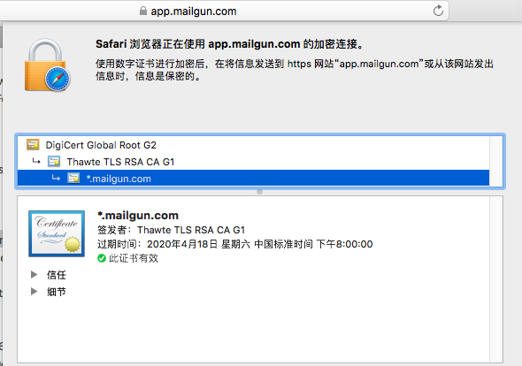

##问题起源

有个项目使用了[mailgun](https://www.mailgun.com)作为邮件服务。已经使用了很长时间，但是在1月22号开始日志文件里面频繁的出现了调用错误：`Caused by: sun.security.validator.ValidatorException: PKIX path building failed: sun.security.provider.certpath.SunCertPathBuilderException: unable to find valid certification path to requested target`我猜想是证书链出可问题，然后开始了解决问题之路。

##如何解决

首先我咨询了mailgun的support，收到的回复是：
>Hello,
>
>Thank you for contacting Mailgun support.
>
>This may be possibly due to our SSL certification renewal, which are now fully completed. This update was pushed out to correct numerous certificates that did not comply with the industry-developed CA/Browser Forum Baseline Requirements by Symantec’s PKI business.

近期他们的确是对证书进行了续期，可能是新证书还没有更新到服务器的环境中（**PS：我不清楚java是否能更新CA的证书信息，还有待验证**）。同时在邮件中提供了一些解决方案，其中我找到了[java and ssl certificates](https://stackoverflow.com/questions/7219989/java-and-ssl-certificates)一篇问答，里面提到了在java启动项中加入ssl证书信息来解决证书信任问题。基本和我的想法一致，只是我并不知道java启动项怎么写:joy:。具体的证书的使用方式可以参考[Working with Certificates and SSL](https://docs.oracle.com/cd/E19830-01/819-4712/ablqw/index.html)。
现在办法我们找到了，直接在启动的时候添加`truststore`就行`-Djavax.net.ssl.trustStore=<path_to_truststore> -Djavax.net.ssl.trustStorePassword=<truststore_password>`。但是证书获取又成了问题，幸好在mailgun的回复中提及`curl`和`PHP`的解决办法
>**If you’re utilizing PHP-**
>
>1) Download the latest CA certificates from (https://curl.haxx.se/docs/caextract.html) This is an extract of a list of certificates vetted by Mozilla.
>
>2) Set the path to the CA certificates in the .htaccess file with a directive like the following:
`php_value curl.cainfo "/path/to/cacert.pem"`
If you have access to your php.ini file, you can modify this value globally by setting `curl.cainfo = "/path/to/cacert.pem"`

>**If you’re utilizing cURL-**
>
Ubuntu users:[How to fix CA cert issues with Curl in Ubuntu 14.04](https://askubuntu.com/questions/646594/how-to-fix-ca-cert-issues-with-curl-in-ubuntu-14-04)

>RedHat users:[How to update cURL CA bundle on RedHat](https://serverfault.com/questions/394815/how-to-update-curl-ca-bundle-on-redhat)
>
>Be sure to restart your sending application after updating.

两个方法都提及了[curl caextract](https://curl.haxx.se/docs/caextract.html)这个网站可以下载最新的CA的根证书。**注意：下载的cacert.pem文件里有很多CA机构的根证书，确保所有的都导入到自己的JKS文件文件中**。
另外一个办法就是用浏览器打开mailgun的网站，直接通过浏览器导出证书文件。这次我就采用的就是这个办法。

##写在最后

由于前段时间对ssl有做了一点功课所以这次的问题解决还是蛮顺利的，写这篇文章纪念一下一个下午的试验。
